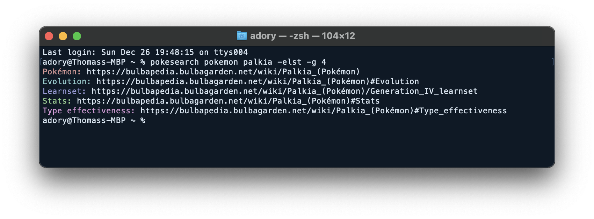

<h1> Pokesearch</h1>
Command line tool for searching Pokemon information.

---

## ⭐ Download
1. Visit the [latest release page](https://github.com/AdoryVo/pokesearch/releases/latest)
2. Download and extract the binaries for your OS
3. Open a terminal inside the extracted folder & run `pokesearch.exe` as a command

## 💡 Usage
- `pokesearch help` - See information on all commands
- `pokesearch config gen [genNumber]` - Set a default gen for learnsets
	- Ex: `pokesearch config gen 4` - Set default gen to IV
- `pokesearch config list` - List configuration values
- `pokesearch pokemon [pokemonName] [flags]` - Search info for a specified Pokemon
	- Ex: `pokesearch pokemon kadabra -elst -g 5`
		- Get Bulbapedia links for Kadabra's Evolution, Gen V Learnset, Stats, and Type Effectiveness

## 🚀 Getting Started (Development)
### Installation
- Download [Go](https://go.dev/learn/)
- Install [Cobra](https://pkg.go.dev/github.com/spf13/cobra#section-readme) with `go get -u github.com/spf13/cobra`
	- To ensure `cobra` works in the command line, make sure `$GOPATH/bin` is in your $PATH. You can check your $GOPATH by running `go env GOPATH`

## ⚙️ Workflow Details
### Development Process
1. Edit the root command & initialization in `cmd/root.go`
2. Edit commands in the `cmd` directory 
	- To add a command, use `cobra add [command]`
	- To add a subcommand with an existing command as a parent, use `cobra add [newCmd] -p [parentCmd]Cmd`
		- Ex: To make `app config create` a command, run `cobra add create -p 'configCmd'`
3. Edit util functions in the `util` directory
4. Run `go run main.go [..commands]` test your commands 

### Build and release
1. Run `make build VERSION=#.#.#` in Linux or WSL
2. Test the executables in `dist/#.#.#`

## ✔️ Current Release Details
### Packages Included
- Cobra - CLI building
- Color - Colorized output
- Viper - CLI config building

## 📅 Future Release Plans
- Other database sources

## 🗒️ Additional Resources
### Best Practices
- [Effective Go](https://go.dev/doc/effective_go)
  
### Documentation
- [A Tour of Go (Go Basics)](https://go.dev/tour/welcome/1)
- [Go By Example](https://gobyexample.com/)
- [Go Docs](https://go.dev/doc/)
- [Color Docs](https://pkg.go.dev/github.com/fatih/color#section-readme)
- [Cobra User Guide](https://github.com/spf13/cobra/blob/master/user_guide.md)
- [Viper Docs](https://github.com/spf13/viper)

